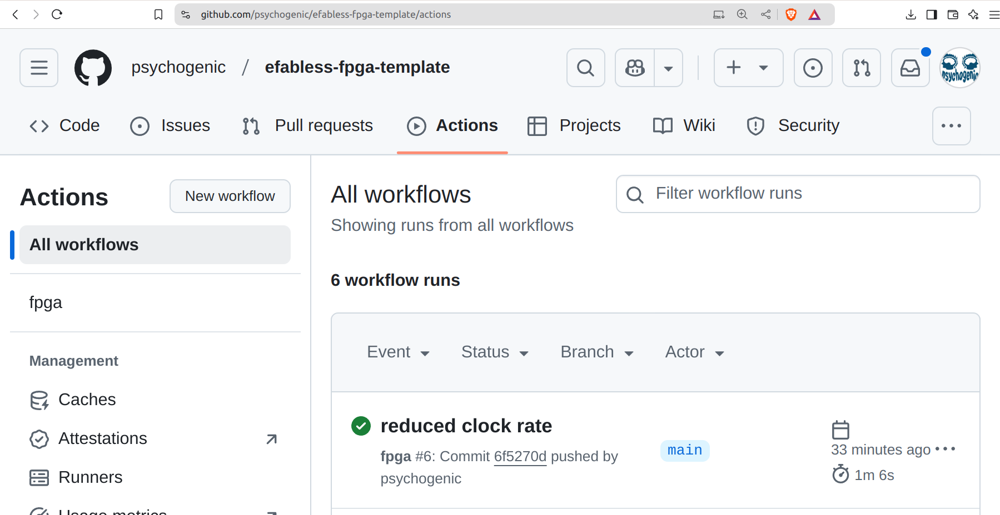
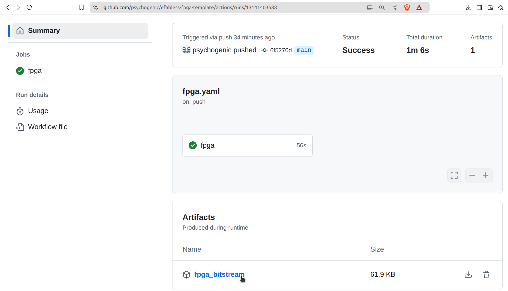

   

# Efabless FPGA dev board

Learn to create digital designs and then get them fabricated on actual silicon using [Tiny Tapeout](https://tinytapeout.com) and [efabless](https://efabless.com/)

- [Read the documentation for project](docs/info.md)

## Quick Start

### Step 1: fork the repo

Fork this repository so you can make changes

### Step 2: create your design

Use [wokwi](https://wokwi.com/) or Verilog to create a digital design.

### Step 3: edit the info.yaml

Edit the info.yaml file to specify all the fields.  Don't forget to set the *clock_hz* field to something appropriate for your design (pretty much anything between 10 and 40000000 Hz will be accepted).

### Step 4: push the changes

Commit your changes and push up to the repository.

### Step 5: get the UF2

Github actions will run on each commit, and you can find them under the actions tab.

Once the run is complete, click on the action and you'll find an `fpga_bitstream` zip file to download.

Grab that, unzip it, and within you'll find the `tt_fpga.uf2` file.  Copy that UF2 to the **FPGAUPDATE** drive.  The project should start running a few seconds later.

## What is Tiny Tapeout?

Tiny Tapeout is an educational project that aims to make it easier and cheaper than ever to get your digital and analog designs manufactured on a real chip.

To learn more and get started, visit https://tinytapeout.com.

## Resources

- [FAQ](https://tinytapeout.com/faq/)
- [Digital design lessons](https://tinytapeout.com/digital_design/)
- [Learn how semiconductors work](https://tinytapeout.com/siliwiz/)
- [Join the community](https://tinytapeout.com/discord)
- [Build your design locally](https://www.tinytapeout.com/guides/local-hardening/)
